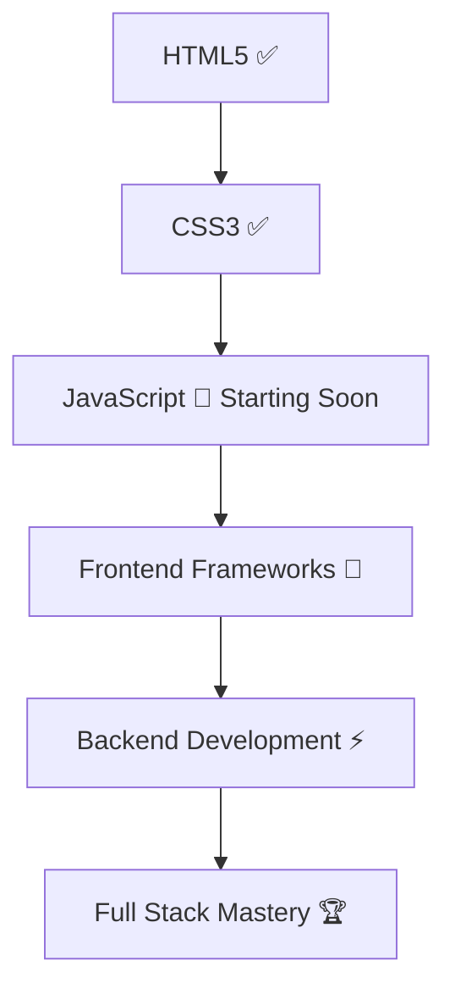

# second-template-
template for learn just using html and css 
# link of (live Demo)
https://second-template-livid.vercel.app/
# 👋 Hey there, I'm **Mahmoud Fawzy**

## 🚀 *Aspiring Full-Stack Developer* | 🎯 *Continuous Learner*

---

  

---

### 🛠️ **Tech Stack:**

  
  
  
  

---

### 📈 **Development Journey:**

---

### 🎯 **Current Goals:**

- 📚 Master JavaScript fundamentals.
- 🔍 Explore front-end frameworks like React.
- 🗂️ Learn database management (MySQL, Oracle, SQLite).
- 🚀 Build real-world projects to enhance problem-solving skills.

---

### 🌟 **Connect With Me:**

  
  

---

### 💡 *"Code, Learn, Repeat! The journey never ends."* 🚀

